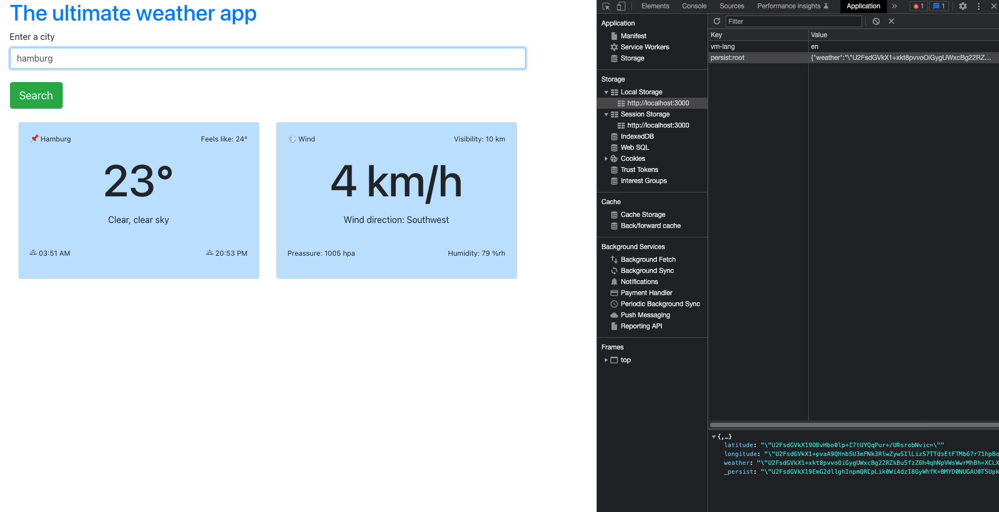

<h1>A weather App</h1>

A weather app showing you the current weather in what ever city you enter in the search field.

Built using the openweathermap API.

<h3>Technology used:</h3>
<h6>React</h6>
<h6>Redux</h6>
<h6>Local Storage</h6>
<h6>JavaScript</h6>
<h6>Bootstrap</h6>
<h3>Images:</h3>
 
